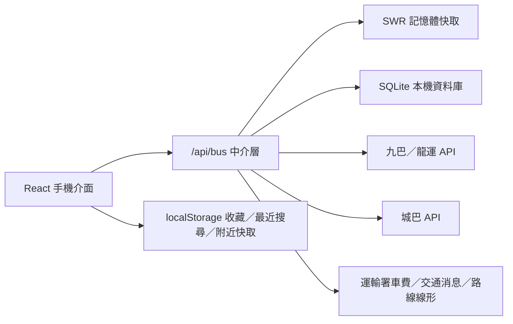

# 香港巴士即時到站網頁

一個以手機為優先、只使用繁體中文的香港巴士即時到站網頁。應用會整合九巴／龍運、城巴及運輸署公開資料，讓使用者快速查看附近巴士、搜尋路線、收藏常用路線、查看完整沿途站點及特別交通消息。

> 這是一個使用官方開放資料的獨立專案，並非九巴、龍運、城巴或香港特別行政區政府的官方應用程式。ETA、車費、路線及交通消息均以上游資料為準。

## 功能

### 附近巴士

- 使用瀏覽器定位自動找出附近可乘搭巴士。
- 合併九巴／龍運與城巴資料，並按路線號碼及英文尾碼自然排序。
- 顯示目的地、當前車站、全程車費、預計實際到站時間及倒數分鐘。
- 最多顯示數班 ETA，並每分鐘在本機重新計算倒數。
- 頁面可見時每 25 秒更新 ETA；切到背景時停止輪詢，回到前景時立即更新。
- 可手動重新整理，並防止 10 秒內重複發出請求。
- 先顯示合適的上次成功附近資料，再於背景更新。

### 路線詳情

- 點選路線後，自動找出使用者最近、方向正確且有 ETA 的可乘搭車站。
- 開啟詳情頁時先顯示完整站序，最近站與 ETA 再異步補上，減少等待感。
- 顯示全程沿途車站，點擊任何車站即可查看該站 ETA。
- 以 Leaflet 與 OpenStreetMap 顯示地圖，並優先對焦最近可乘搭車站。
- 路線線形來自運輸署 CSDI 路線幾何資料，不是單純以站點最短距離直線連接。
- 可以收藏或取消收藏路線方向。

### 搜尋路線

- 只按路線號碼搜尋，不會對地點、地址或車站名稱進行關鍵字搜尋。
- 使用固定的自訂大型鍵盤，不會叫出手機原生鍵盤。
- 數字鍵位於左方，英文字母位於右方並按 A-Z 排列。
- 輸入數字後，只顯示實際存在的下一個英文尾碼；例如輸入 `1` 時可顯示 `A`、`M`、`P`等有效字母。
- 同一路線的去程、回程及不同目的地會分開顯示。
- 保存最近搜尋，可一鍵清除；沒有紀錄時顯示熱門路線 `11X`、`601`、`88`、`95`。

### 收藏

- 只儲存路線、方向、目的地、服務類別及內部營辦商識別，不儲存使用者位置、車站或 ETA。
- 以 `localStorage` 儲存於當前瀏覽器。
- 整張收藏卡片都可點擊進入路線詳情。
- 開啟收藏路線時，仍會按當前位置重新尋找最近可乘搭車站。

### 交通通知與官方資料庫

- 由首頁右上角鈴鐺開啟交通通知，不佔用第四個底部分頁。
- 讀取運輸署「特別交通消息」XML，顯示最新交通及公共運輸影響資訊。
- 通知中心內含 SQLite 資料庫狀態，可查看車費、路線方向、車站及已儲存路線線形數量。
- 「更新官方資料」會從官方來源重新下載車費、九巴／龍運與城巴網絡，驗證筆數後寫入現有 SQLite 資料庫。
- 更新已儲存的路線線形；個別線形更新失敗時保留舊版本。

### PWA 與離線殼層

- 提供 Web App Manifest，可加入手機主畫面。
- 正式版會註冊 Service Worker，快取導航殼層及同源靜態資源。
- API 請求保持網路優先，不會在離線時把 HTML 錯當成 JSON 回傳。

## 技術架構

| 層級 | 技術 | 用途 |
| --- | --- | --- |
| 前端 | React、TypeScript | 手機優先介面、狀態與互動 |
| 建置／開發 | Vite | 前端建置、本機開發伺服器及同源 API middleware |
| 地圖 | Leaflet、OpenStreetMap | 路線地圖、站點及最近站對焦 |
| API 中介層 | Node.js、TypeScript | 統一營辦商格式、輸入驗證、超時、快取及錯誤處理 |
| 資料庫 | Node.js `node:sqlite` | 車費、路線、車站、站序、路線線形及更新 metadata |
| 測試 | Vitest | 快取、地理距離、ETA、車費、搜尋、收藏、資料庫等單元測試 |



## 官方資料來源

| 資料 | 來源 |
| --- | --- |
| 九巴／龍運路線、車站、站序、ETA | [KMB ETA Open Data](https://data.etabus.gov.hk/v1/transport/kmb) |
| 城巴路線、車站、站序、ETA | [Citybus ETA Open Data](https://rt.data.gov.hk/v2/transport/citybus) |
| 巴士全程車費 | [運輸署 JSON_BUS.json](https://static.data.gov.hk/td/routes-fares-geojson/JSON_BUS.json) |
| 巴士路線線形 | [運輸署 CSDI 路線資料](https://portal.csdi.gov.hk/server/rest/services/common/td_rcd_1638844988873_41214/MapServer/0/query) |
| 特別交通消息 | [Data.gov.hk 即時 XML](https://resource.data.one.gov.hk/td/en/specialtrafficnews.xml) |
| 地圖底圖 | [OpenStreetMap](https://www.openstreetmap.org/) |

車費只會在路線、方向、目的地及營辦商可靠配對時顯示。現時顯示的是官方「全程車費」，不應解讀為指定上車站的分段實付車費。無法可靠配對時介面會標示資料未提供，不會估算或捏造金額。

## 環境要求

- Node.js `22.13` 或以上；建議使用 Node.js 24 LTS。專案使用內建 `node:sqlite`。
- npm 10 或以上。
- 可連線至上述官方資料網址的網路。
- 手機定位測試必須使用 HTTPS，或在本機以 `localhost` / `127.0.0.1` 開啟。
- 如要使用 Cloudflare Quick Tunnel，需另外安裝 `cloudflared`、Bash 及 `curl`。

## 快速開始

### 1. 安裝依賴

```bash
npm install
```

如需完全按 `package-lock.json` 重現安裝，可使用：

```bash
npm ci
```

### 2. 啟動開發伺服器

```bash
npm run dev
```

Vite 會在終端顯示本機網址，預設通常是 [http://localhost:5173](http://localhost:5173)。開發伺服器同時掛載 `/api/bus` middleware，因此不需要再單獨啟動後端。

### 3. 建置與預覽正式版

```bash
npm run build
npm run preview
```

`npm run build` 會先進行 TypeScript project build，再輸出前端檔案至 `dist/`。`npm run preview` 也會掛載同一個 API middleware，適合本機驗收。

> 只開啟 `dist/index.html` 或只將 `dist/` 上傳至純靜態空間並不足夠，因為 ETA、附近路線、交通消息及資料庫更新都依賴 `/api/bus`。

## 手機 HTTPS 測試

專案提供 Cloudflare Quick Tunnel 腳本，會：

1. 從指定連接埠開始尋找可用連接埠。
2. 啟動本機 Vite 伺服器。
3. 建立一個臨時 `https://*.trycloudflare.com` 公開網址。
4. 在按 `Ctrl+C` 後同時停止 Vite 及 Tunnel。

Git Bash：

```bash
bash scripts/quick-tunnel.sh
```

從其他連接埠開始，例如 `5180`：

```bash
bash scripts/quick-tunnel.sh 5180
```

也可使用環境變數：

```bash
PORT=5180 bash scripts/quick-tunnel.sh
```

腳本會在終端印出手機 HTTPS 網址與本機網址。請保持終端開啟；Quick Tunnel 網址每次都會改變，沒有 uptime SLA，只適合臨時測試，不應用作正式部署。

## SQLite 資料庫

### 預設位置

```text
server/data/bus-data.sqlite
```

第一次啟動 API 時會自動建立 schema，開啟 WAL mode，並在資料表為空時從以下內建種子檔案初始化車費與城巴索引：

```text
server/data/bus-fares.json
server/data/citybus-network.json
```

SQLite 檔案、WAL 及 SHM 檔案已列入 `.gitignore`，不會提交到 Git。

### 資料表

- `metadata`：資料來源及最後更新時間。
- `fares`：路線方向與全程車費。
- `citybus_stops` / `citybus_memberships`：城巴附近搜尋索引。
- `operator_routes`：各營辦商路線及方向。
- `operator_stops`：車站名稱與經緯度。
- `operator_route_stops`：指定路線、方向及服務類別的站序。
- `route_geometries`：已取得的官方路線線形。

### 更新資料庫

開啟首頁右上角交通通知，再按「更新官方資料」。更新流程會：

1. 下載及驗證運輸署車費資料。
2. 下載九巴／龍運路線、全部車站及站序。
3. 並行下載城巴路線、站序及車站。
4. 驗證最低合理筆數，再以 SQLite transaction 取代相關網絡資料。
5. 清除中介層記憶體快取。
6. 重新下載所有已儲存的官方路線線形。

更新時介面每秒輪詢進度。如下載筆數不合理或發生錯誤，未成功取代的部分會保留原有版本。由於城巴需要讀取大量逐路線及逐站端點，完整更新可能需要數分鐘。

### 離線產生 JSON 種子檔

重建城巴附近搜尋索引：

```bash
npm run data:citybus
```

從官方網址下載並重建車費索引：

```bash
npm run data:fares
```

使用已下載的 GeoJSON：

```bash
npm run data:fares -- path/to/JSON_BUS.json
```

這些指令會直接更新 `server/data/*.json`，適合維護專案內建種子資料；一般執行期更新應使用介面的資料庫更新按鈕。

## API

所有端點使用同一路徑：

```text
/api/bus?action=...
```

| 方法 | `action` | 用途 | 主要參數 |
| --- | --- | --- | --- |
| GET | `routes` | 取得合併後的路線與方向 | 無 |
| GET | `stops` | 取得所有車站 | 無 |
| GET | `routeStops` | 取得指定路線站序 | `operator`, `route`, `direction`, `serviceType` |
| GET | `routeGeometry` | 取得官方路線線形 | `operator`, `route`, `direction`, `serviceType` |
| GET | `eta` | 取得指定車站及路線 ETA | `operator`, `route`, `stopId`, `serviceType` |
| GET | `nearby` | 取得附近可乘搭路線 | `latitude`, `longitude`, 可選 `refresh=1`, `quick=1` |
| GET | `nearestRoute` | 找出指定路線最近可乘搭站 | `operator`, `route`, `direction`, `serviceType`, `latitude`, `longitude`, 可選 `refresh=1` |
| GET | `alerts` | 取得特別交通消息 | 無 |
| GET | `databaseStatus` | 取得資料庫筆數與更新進度 | 無 |
| POST | `updateDatabase` | 開始背景更新資料庫 | Header `X-Bus-Data-Update: requested-by-app` |

`operator` 只接受：

- `kmb-lwb`
- `citybus`

`direction` 只接受：

- `outbound`
- `inbound`

範例：

```text
GET /api/bus?action=routeStops&operator=kmb-lwb&route=1&direction=outbound&serviceType=1
GET /api/bus?action=eta&operator=citybus&route=1&stopId=002403&serviceType=1
GET /api/bus?action=nearby&latitude=22.288274&longitude=114.150422
```

API 會驗證營辦商、方向、路線、車站識別碼與座標，再組成上游請求。CORS 預設為 `*`，可透過 `BUS_API_ALLOWED_ORIGIN` 收窄。

> `X-Bus-Data-Update` 目前只是防止一般誤發的應用內請求標記，不是密碼或管理員身份驗證。如將服務公開部署，應在 reverse proxy 或伺服器層加入真正的管理員授權、CSRF 防護及 rate limiting，或關閉公開更新端點。

## 快取與更新策略

| 資料 | 新鮮期 | 失效回退期 |
| --- | ---: | ---: |
| 路線及全站資料 | 14 日 | 30 日 |
| 路線站序 | 7 日 | 30 日 |
| ETA | 20 秒 | 10 分鐘 |
| 路線線形 | 14 日 | 45 日 |
| 特別交通消息 | 5 分鐘 | 當次伺服器進程內的最後成功結果 |

中介層使用 stale-while-revalidate 概念：資料過了新鮮期後，如仍在可回退期內，可先回傳最後成功資料，再於背景更新。同一快取鍵的並發請求共用同一個上游請求。ETA 會過濾已離站或無效時間，並不會使用一日前的資料顯示虛假「0 分鐘」。

## 環境變數

| 變數 | 預設值 | 說明 |
| --- | --- | --- |
| `BUS_DATABASE_PATH` | `server/data/bus-data.sqlite` | SQLite 檔案路徑。正式部署應指向可寫及持久化磁碟。 |
| `BUS_API_ALLOWED_ORIGIN` | `*` | `/api/bus` 的 `Access-Control-Allow-Origin`。 |
| `PORT` | `5173` | `quick-tunnel.sh` 搜尋本機可用連接埠的起點；也可以第一個位置參數覆蓋。 |

PowerShell 範例：

```powershell
$env:BUS_DATABASE_PATH = 'D:\bus-data\bus-data.sqlite'
$env:BUS_API_ALLOWED_ORIGIN = 'https://bus.example.com'
npm.cmd run dev
```

Bash 範例：

```bash
BUS_DATABASE_PATH=/var/lib/hk-bus/bus-data.sqlite \
BUS_API_ALLOWED_ORIGIN=https://bus.example.com \
npm run dev
```

## 開發測試模式

以下 query parameters 只在 Vite 開發模式生效：

| 網址參數 | 用途 |
| --- | --- |
| `?testLocation=central` | 使用中環測試座標，無需開啟真實定位。 |
| `?testLocation=denied` | 模擬定位未獲授權。 |
| `?testLocation=loading` | 維持定位請求中狀態。 |
| `?testOffline=1` | 模擬附近巴士 API 離線錯誤。 |
| `?testAlerts=1` | 注入開發用通知資料，驗證排序及未讀紅點。 |

範例：

```text
http://localhost:5173/?testLocation=central
http://localhost:5173/?testAlerts=1
```

## 品質驗證

執行 TypeScript 型別檢查：

```bash
npm run typecheck
```

執行所有 Vitest 測試：

```bash
npm test
```

執行單一測試檔：

```bash
npm test -- src/services/route-search.test.ts
```

建置正式版：

```bash
npm run build
```

建議每次改動後至少執行：

```bash
npm run typecheck
npm test
npm run build
```

介面改動應另外以手機尺寸驗收，尤其是 `320px`、`390px` 及 `430px` 寬度，並檢查底部導覽、鍵盤、滾動區域、路線地圖與長站名是否重疊。

## 部署

### 必要條件

正式環境不只是靜態 React 網站，還必須提供：

- 可執行 Node.js TypeScript/ESM API 的運行環境。
- 可寫入且會持久保留的 SQLite 磁碟路徑。
- 對官方資料來源的出站 HTTPS 連線。
- 同源 `/api/bus` 路由，或正確的 reverse proxy 設定。
- HTTPS，否則手機瀏覽器通常不會提供 Geolocation API。

`api/bus.ts` 是給 Node 形式 serverless handler 的轉接檔，但很多 serverless 平台的本機檔案系統是暫存或只讀的。如沒有持久磁碟，「更新官方資料」在新 instance 啟動後可能遺失，SQLite 也不適合由多個無共用磁碟的 instance 同時寫入。

建議正式部署使用具有持久 volume 的單一 Node 服務，並將 `BUS_DATABASE_PATH` 指向該 volume。如需水平擴展，應先把持久層移至共用資料庫，並把資料更新改為受保護的單一後台工作。

## 專案目錄

```text
.
├── api/
│   └── bus.ts                         # Node serverless API adapter
├── docs/                              # 各階段技術紀錄
├── public/
│   ├── icons/bus-icon.svg
│   ├── manifest.webmanifest
│   └── sw.js                          # PWA Service Worker
├── scripts/
│   ├── build-bus-fare-index.mjs       # 重建車費 JSON 種子檔
│   ├── build-citybus-index.mjs        # 重建城巴 JSON 種子檔
│   └── quick-tunnel.sh                # 手機 HTTPS 臨時測試
├── server/
│   ├── api/handler.ts                 # /api/bus 路由與回應
│   ├── data/                          # JSON 種子資料與執行期 SQLite
│   ├── database/bus-database.ts       # SQLite schema 與 repository
│   ├── domain/                        # 後端類型與輸入驗證
│   ├── infrastructure/                # Fetch 與 SWR 快取
│   ├── operators/                     # 九巴／龍運及城巴 adapter
│   └── services/                      # 附近、車費、線形、通知、更新服務
├── src/
│   ├── components/                    # 頁面與 UI 元件
│   ├── hooks/                         # 定位、收藏、通知、分鐘時鐘
│   ├── services/                      # 前端 API、搜尋、ETA、快取工具
│   ├── App.tsx
│   ├── main.tsx
│   └── styles.css
├── package.json
├── vite.config.ts
└── vitest.config.ts
```

## 私隱與資料儲存

- 使用者座標只用於同源 API 計算附近車站及最近可乘搭路線。
- 介面不顯示精確位置、地址或使用者位置地圖。
- 前端會在 `localStorage` 保存收藏、最近搜尋、最後成功附近資料及已讀通知識別碼。
- 最後位置會在當前頁面進程的記憶體內快取 10 分鐘，不寫入收藏。
- 專案沒有帳戶、登入、跨裝置同步或第三方廣告追蹤。

## 已知限制

- ETA 與服務狀態取決於上游官方資料的準確度、更新速度及可用性。
- 不是每條路線都可靠配對全程車費或官方路線線形。
- 車費並非指定上車站的分段車費。
- 交通消息是運輸署特別交通消息，不是完整的營辦商內部通告。
- 地圖底圖需要網路；PWA 離線殼層不代表可離線取得新 ETA。
- 目前的 SQLite 架構適合單一伺服器進程或共用持久 volume，不適合沒有共用磁碟的大量無狀態 instances。

## License

本 repository 目前沒有附帶開源授權檔案。在未加入 `LICENSE` 前，不應假設原始碼可以自由再授權或商業使用。官方公開資料及 OpenStreetMap 地圖仍分別受其來源條款與標示要求約束。
